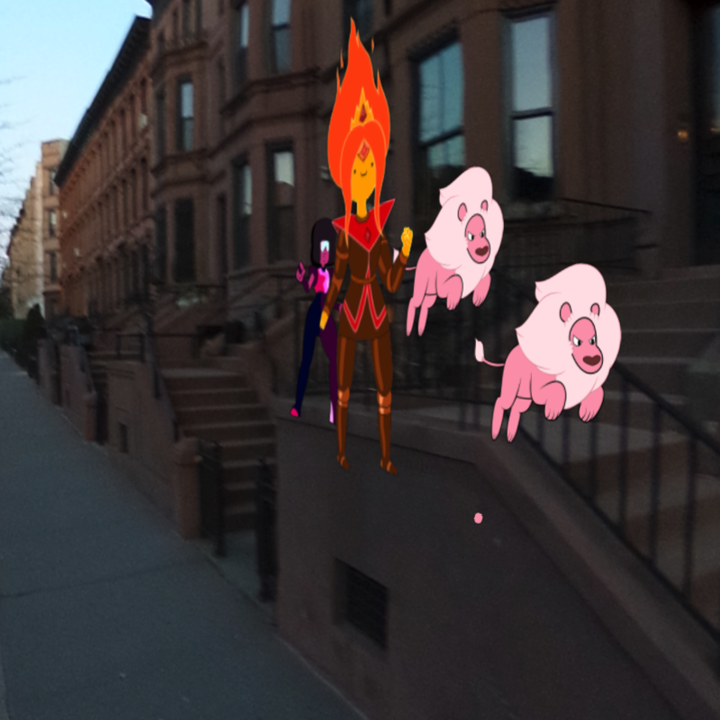

# (re)Creating 3d spaces

What are the advantages of working in 3D? What can we get out of it and what does it mean for human perception? Actually, a lot. The world that surrounds us is three-dimensional. That's how we understand the world, how we traverse it. So, naturally having a 3D environment is the best way for us to create new stories and for other people to relate to them. But it's not that easy...
<!--more-->

## (kinda) easy panoramic surroundings
First of all, creating the setting of a scene is crucial. And a very easy way to fill a 360 "space" is to get a panorama 360 photograph and use it as a texture for the inside of a sphere, placing yourself on the inside. I used a [Ricoh Theta S](https://theta360.com/en/about/theta/s.html), a small device that uses two fish-eye 180 degree cameras and stitches them together to take very simple 360 pictures.

Easy, right? Well, yeah. But the results are wanting. The first problem is me. Yup, that's right. I'm in the picture, under the camera; my hand is gigantic (*look at that thumb!*).

This device is very quick and feels great to take spontaneous panoramas, but this issue makes it really difficult to use for footage without a lot of editing. This brings up the questions of *"how to compose?"* or *"how to get away from the shot?"*

Another issue is that this does not give you any perspective, it does not relate the objects in the scene with the background. This can be seen bellow, where my characters are on top of the car, floating on the street or in front of the house. And on that last one, we would think it'd be amazing for the characters to be on the stairs, behind the fence, but that is only part of the texture. The fence does not exist as an element in front of the stairwell.

Finally, something I wanted to do was having two layers of panoramas. First, a room with windows, and another layer that shows a night sky. To do that, you *only* need to edit the windows out of the room panorama and make it transparent. But (of course there's a but -and it's not a butt-) it's very hard to edit images with these types of projections. Thanfully, there are some tools to deal with this! [flexify](http://www.flamingpear.com/flexify-2.html) is a Photoshop extension to change the perspective of the pictures and recreate them in another projection matrices.

## virtual challenges for the real developer
Thinking more about what how to design in 3D, from [this article about attention in VR](https://medium.com/the-language-of-vr/in-the-blink-of-a-mind-attention-1fdff60fa045) I got to [this one about the freedom of storytelling in VR](https://medium.com/the-language-of-vr/how-to-greet-a-rebel-unlocking-the-storyteller-in-vr-d40b2cc05f55) and it relates to many things I've been experimenting (and struggling) with.

Reality is a lot more boring than we realize. It has multiple focal points, the action is occurring in multiple places, and is much more random and nonsensical than we think it is. When translating these elements to VR (or even in normal film), the action will be all over the place, without a clear direction of what's happening.

The question is about what do we want to represent: "realness" or "realistic" fiction? Fiction lets us build a narrative and a world that only has elements that will drive the story forward, without all the "noise" of the real world. It does not mean that other elements will not be present, but that what we incorporate into the scenes, need to have a purpose within the story.
