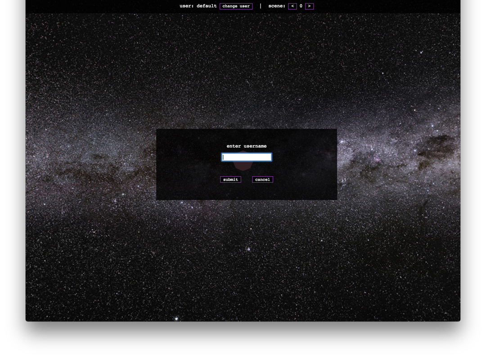
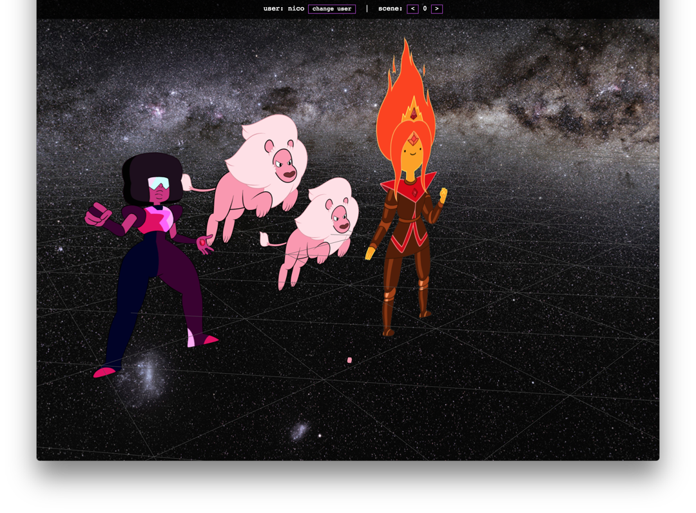
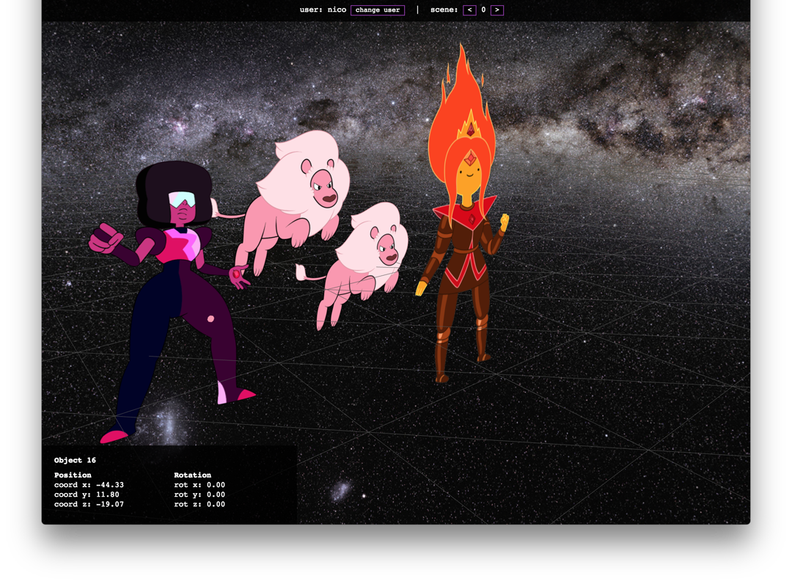

# users wanna use

A platform for users to freely make 3D content and have more expressive tools is amazing, but... if they cannot interact with the scene, it's not that useful. Thus, this week I focused on creating some user tools on the website, such as the possibility to change user, scene and get the coordinates of an object.
<!--more-->


## user(s trying to) experience
I had to think about how the flow of the application is for any user. If they get to the page, they will want to be able to log into their user as the first thing they do. Not that hard, right? Well, if you already have a ton of stuff going on, it might get tricky.

Making a box float in front of the screen is not really a problem. Even clicking on buttons is not one either (somehow, I'm still impressed by this), but trying to access a text box input... Nope. The threejs sketch captures the mouse focus, making each mouse action control the camera. Hence, focusing on a text box is impossible. I used two fixes to this problem:

1. **Focus** on the text box with `document.getElementById("input_username").focus();`. HTML gives you the ability to force the focus on an element, so it seems intuitive to do that when you open a new menu that only requires a text input.
2. **Disable the controls**, as clicking anywhere else can make the text box lose focus. In order to let the mouse recover the normal actions, the threejs controls need to be disabled with `controls.enabled = false;`.




## manipulative users
At the same time, users want to be able to move, rotate, delete, rename, etc the objects I have on scene (and hopefully, animate them!). This leads to the second problem I had to solve: selecting elements and displaying their information.

If I select an object, I want to be able to do something with it. The most common actions would be move and rotate them, but if the camera controls keep working, it would be an impossible task to do. At the same time, I don't want the user to be able to select something if there's a menu screen on top. And last, but not least, the user needs to be able to deselect the object. This leads to the creation of many global variables to keep track of everything that's going on. `menu_object_on`, `selected_obj` and messing again with the `enabled` property of the controls was how I took care of it.


```javascript
let intersects = raycaster.intersectObjects( scene_objects );
// get the first element
if (intersects.length > 0 && !menu_on ){
  // assign object
  selected_obj = intersects[0].object;
  menu_object_on = true;
  openMenu( document.querySelector("#menu_object") );
  controls.enabled = false;
  // update object labels
  updateObjectLabels();
} else {  // if we didn't click on anything, deselect
  // DEasign object
  selected_obj = null;
  menu_object_on = false;
  closeMenu( document.querySelector("#menu_object") );
  controls.enabled = true;
  // update object labels
  updateObjectLabels();
}
```




